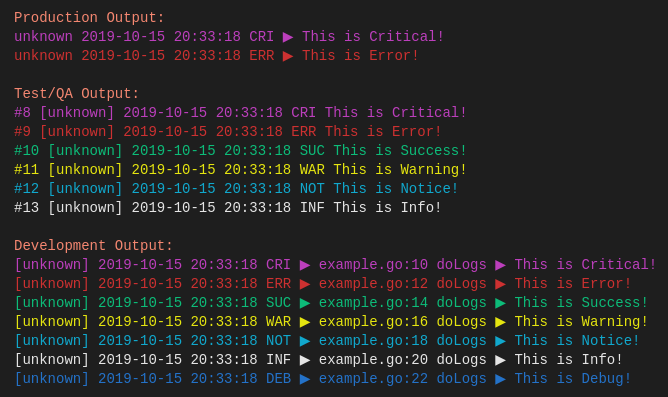

# golog

[](https://travis-ci.org/AndrewDonelson/golog)
[](https://coveralls.io/github/AndrewDonelson/golog)
[](http://godoc.org/github.com/AndrewDonelson/golog)

Versatile Go Logger with a focus on Build Environments to provide performance and information where needed. Also allows setting custom format for messages.

# Notice

**Even though this is currently building, Use it at your own risk. IT IS NOT quite ready for use IMHO.**

If you would like to help, please do so. Besides the obvious performance tweaks checkout the issues and do a PR. Please make sure to handle code coverage.

# Preview

[](example/example.go)

# Install

`go get github.com/AndrewDonelson/golog`

Use `go get -u` to update the package.

# Example

Example [program](example/example.go) demonstrates how to use the logger. See below for __formatting__ instructions.

```go
package main

import (
	"github.com/AndrewDonelson/golog"
)

func doLogs(log *golog.Logger) {
	log.SetFunction("doLogs")
	// Critically log critical
	log.Critical("This is Critical!")
	// Show the error
	log.Error("This is Error!")
	// Show the success
	log.Success("This is Success!")
	// Give the Warning
	log.Warning("This is Warning!")
	// Notice
	log.Notice("This is Notice!")
	// Show the info
	log.Info("This is Info!")
	// Debug
	log.Debug("This is Debug!")
}

func main() {
	// Get the instance for logger class
	// Third option is optional and is instance of type io.Writer, defaults to os.Stderr
	println("\nProduction Output:")
	log, err := golog.NewLogger(nil)
	if err != nil {
		panic(err) // Check for error
	}
	log.SetEnvironment(golog.EnvProduction)
	doLogs(log)

	println("\nTest/QA Output:")
	log, err = golog.NewLogger(nil)
	if err != nil {
		panic(err) // Check for error
	}
	log.SetEnvironment(golog.EnvQuality)
	doLogs(log)

	println("\nDevelopment Output:")
	log, err = golog.NewLogger(nil)
	if err != nil {
		panic(err) // Check for error
	}
	log.SetEnvironment(golog.EnvDevelopment)
	doLogs(log)
}
```

# Formatting

By default all log messages have format that you can see above (on pic).
But you can override the default format and set format that you want.

You can do it for Logger instance (after creating logger) ...

```go
log, _ := logger.New("pkgname", 1)
log.SetFormat(format)
```

... or for package

```go
golog.SetDefaultFormat(format)
```

If you do it for package, all existing loggers will print log messages with format that these used already.
But all newest loggers (which will be created after changing format for package) will use your specified format.

But anyway after this, you can still set format of message for specific Logger instance.

Format of log message must contains verbs that represent some info about current log entry.
Ofc, format can contain not only verbs but also something else (for example text, digits, symbols, etc)

## Format verbs

You can use the following verbs:

| Verb | Description |
| ----------- | ----------- |
| %{id} | number of current log message |
| %{module} | module name (that you passed to func New()) | 
| %{time} | current time in format "2006-01-02 15:04:05" |
| %{time:format} | current time in format that you want |
| %{level} | level name (upper case) of log message ("ERROR", "DEBUG", etc) |
| %{lvl} | first 3 letters of level name (upper case) of log message |
| %{file} | name of file in what you wanna write log |
| %{filename} | the same as %{file} |
| %{line} | line number of file in what you wanna write log |
| %{message} | your log message |

Non-existent verbs (like ```%{nonex-verb}``` or ```%{}```) will be replaced by an empty string.
Invalid verbs (like ```%{inv-verb```) will be treated as plain text.

# Tests

Run:

- `go test -v` to run test on logger.
- `go test -bench=.` for benchmarks.

## Thanks

golog is not a fork, but it was the starting point for the project. 
I'd like to thank all out there which helped with go-logging.

Following contributors have made major contributions to go-logger:

- [@qioalice](https://github.com/qioalice)
- [@gjvnq](https://github.com/gjvnq)
- [@maezen](https://github.com/maezen)

## License

The [BSD 3-Clause license](http://opensource.org/licenses/BSD-3-Clause), the same as the [Go language](http://golang.org/LICENSE).
