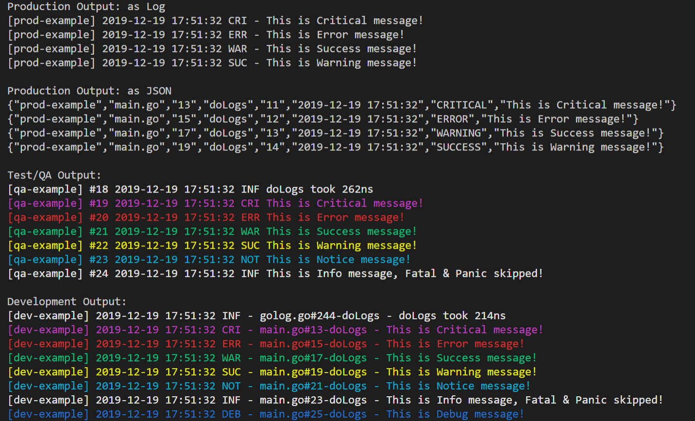

# golog

[](https://travis-ci.org/AndrewDonelson/golog)

[](https://coveralls.io/github/AndrewDonelson/golog)
[](https://www.codacy.com/manual/AndrewDonelson/golog?utm_source=github.com&amp;utm_medium=referral&amp;utm_content=AndrewDonelson/golog&amp;utm_campaign=Badge_Grade)
[](http://godoc.org/github.com/AndrewDonelson/golog)


Versatile Go Logger with a focus on Build Environments to provide performance and information where needed. Also allows setting custom format for messages.

## Notice

If you would like to help, please do so. Besides the obvious performance tweaks checkout the issues and do a PR. Please make sure to handle code coverage.

## Preview

[](examples/basic/main.go)

## Install

`go get -u github.com/AndrewDonelson/golog`

This will either Install or Update the package.

## Example

Example [program](examples/basic/main.go) demonstrates how to use the logger. See below for *formatting* instructions.

```go
package main

import (
   "github.com/AndrewDonelson/golog"
)

func main() {
    // Get the instance for logger class
    // Third option is optional and is instance of type io.Writer, defaults to os.Stderr
    println("\nProduction Output: as Log")
    log, err := golog.NewLogger(&golog.Options{Module: "prod-example"})
    if err != nil {
        panic(err) // Check for error
    }
    log.SetEnvironment(golog.EnvProduction)

    method := "main"
    log.Trace(method, "main.go", 7)
    log.SetFunction(method)

    // Critically log critical
    log.Critical("This is Critical message!")
    // Show the error
    log.Error("This is Error message!")
    // Show the success
    log.Success("This is Success message!")
    // Give the Warning
    log.Warning("This is Warning message!")
    // Notice
    log.Notice("This is Notice message!")
    // Show the info
    log.Info("This is Info message, Fatal & Panic skipped!")
    // Debug
    log.Debug("This is Debug message!")
}
```

## Example Usage

You can set a environment variable BUILD_ENV to either \[dev, qa or prod] and when a logger is created it will auto-detect and set the proper environment. After
creating the logger you may of course manually set the environment by using `log.SetEnvironment({EnvDevelopment})`. Below are the Options for when creating a Custom Logger:

```go
// Options allow customization of the logger by the end user
type Options struct {
   Module      string      // Name of running module
   Environment Environment // Override default handling
   UseColor    ColorMode   // Enable color (override) default handling
   Out         io.Writer   // Where to write output
   FmtProd     string      // for use with production environment
   FmtDev      string      // for use with development environment
}
```

### Creating New Logger

There is no need to manually create a logger. Simply import golog and start using.

```go
golog.Log.SetModule("myapp")
err := RunSomeFunction()
if err != nil {
   golog.Log.ErrorE(err)
}
```

#### Default (minumum)

```go
 // Create a logger with all default options
 log, err := golog.NewLogger(nil)
 if err != nil {
    panic(err) // Check for error
 }
```

#### Typical

```go
// create a new golag logger
log, err := golog.NewLogger(&golog.Options{Module: "myapp"})
if err != nil {
   panic(err) // Check for error
}
// You can set the Environment here, or in the above NewLogger() call but suggested way
// is to use an OS Environment variable named "BUILD_ENV" to set either dev or qa. 
// Anything else would be considered production
log.SetEnvironment(golog.EnvProduction)
```

Custom

```go
 log, err = NewLogger(&Options{Module: "my-service", UseColor: clrDisabled})
 ```

This will create a new logger with the module name `my-service` and color disabled.

### Formatting

By default all log messages have format that you can see above (on pic).
But you can override the default format and set format that you want.

You can do it for Logger instance (after creating logger) ...

```go
// Default (minumum)
 log, err := golog.NewLogger(nil)
 if err != nil {
    panic(err) // Check for error
 }
log, _ := logger.New("pkgname", 1)
log.SetFormat(format)
```

... or for package

```go
golog.SetDefaultFormat(format)
```

If you do it for package, all existing loggers will print log messages with format that these used already. But all newest loggers (which will be created after changing format for package) will use your specified format.

But anyway after this, you can still set format of message for specific Logger instance.

Format of log message must contains verbs that represent some info about current log entry. Ofc, format can contain not only verbs but also something else (for example text, digits, symbols, etc)

#### Format verbs

You can use the following verbs:

| Verb           | Description                                                    |
|:-------------- |:-------------------------------------------------------------- |
| %{id}          | number of current log message                                  |
| %{module}      | module name (that you passed to func New())                    |
| %{time}        | current time in format "2006-01-02 15:04:05"                   |
| %{time:format} | current time in format that you want                           |
| %{level}       | level name (upper case) of log message ("ERROR", "DEBUG", etc) |
| %{lvl}         | first 3 letters of level name (upper case) of log message      |
| %{file}        | name of file in what you wanna write log                       |
| %{filename}    | the same as %{file}                                            |
| %{line}        | line number of file in what you wanna write log                |
| %{message}     | your log message                                               |

Non-existent verbs (like ```%{nonex-verb}``` or ```%{}```) will be replaced by an empty string.
Invalid verbs (like ```%{inv-verb```) will be treated as plain text.

## Tests

Run:
```sh
  - `go test -v .` to run test on logger.
  - `go test -bench .` for benchmarks.
```

## Benchmarks

```sh
BenchmarkLoggerNew-12             500000              4557 ns/op
BenchmarkLoggerNewLogger-12       500000              4323 ns/op
```

## Usage
- make           # everything
- make test      # just run tests
- make bencH     # just run benchmarks
- make build     # just build examples
- make run       # just run examples

## Thanks

golog is not a fork, but it was the starting point for the project.
I'd like to thank all out there which helped with go-logging.

Following contributors have made major contributions to go-logger:

- [@qioalice](https://github.com/qioalice)
- [@gjvnq](https://github.com/gjvnq)
- [@maezen](https://github.com/maezen)

## License

The [BSD 3-Clause license](http://opensource.org/licenses/BSD-3-Clause), the same as the [Go language](http://golang.org/LICENSE).
